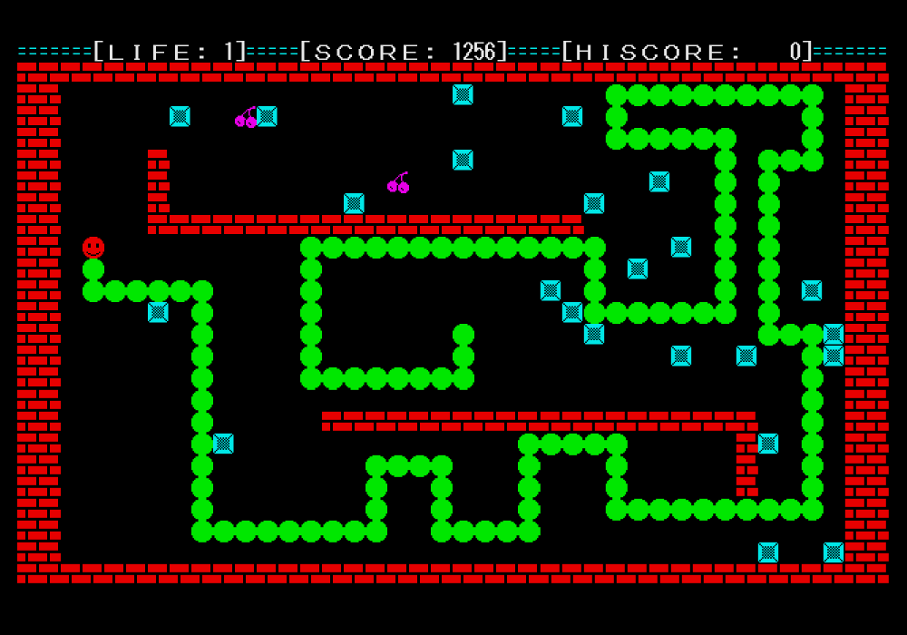

# xbasip: X-BASIC like package for micropython-x68k

[MicroPython for X68000](https://github.com/yunkya2/micropython-x68k)用にX-BASIC風の関数群パッケージを作成しました。ほとんどIOCSCALLやDOSCALLを呼んでいるだけですが、X-BASICの情報を活かしながらX68KでPythonプログラミングを始める参考になれば幸いです。

MycroPython v1.20.0-x68k-1.3で動作を確認しています。

## 使い方

`xbasip`フォルダをそのままカレントフォルダ直下に置き、次の様にインポートして使用します。

```python
from xbasip import *

screen(2, 0, 1, 1)
cls()

locate(10, 5)
color(1)
print("hello micropython-x68k", end="")
color(2)
print(" *" * 10)
locate(15, 6)
color(3)
print("hello xbasip!")

circle(300, 200, 100, 10)
paint(300, 200, 11)
palet(10, rgb(24, 24, 20))
palet(11, rgb(0, 16, 15))

end()
```

xbasipパッケージは下記の複数のモジュールから構成されています。

* `console` -- コンソール(width, locate, inkeyなど)
* `graph` -- グラフィック
* `sprite` -- スプライト
* `audio` -- ADPCM
* `music` -- FM音源
* `mouse` -- マウス
* `stick` -- ジョイスティック
* `tgraph` -- テキストグラフィック

モジュールを個別にimportすることもできます。

```python
from xbasip.music import *

m_init()
m_alloc(1, 100)
m_assign(1, 1)
m_trk(1, b"Q7@1V9O4CDEFGAB<C")
m_play()
```

musicモジュールを使用するには、opmdrv3.xもしくは[zmusic2.x](http://retropc.net/x68000/software/sound/zmusic/zmusic2/)をシステムに組み込んでおく必要があります。

## サンプルプログラム

* wormgame.py
  - キャラクタベースのレトロなBASIC風ゲーム
  
* sample01.py
  - locate, color, print, inkeyなどコンソール関数の使用例。[実行画面](image/sample01.png)
* sample02.py
  - グラフィック関数。[実行画面](image/sample02.png)
* sample03.py
  - スプライト関数の使用例。[実行画面](image/sample03.png)
* sample04.py
  - FM音源関数、ADPCM関数の使用例。[実行画面](image/sample04.png)
* sample05.py
  - マウス関数、ジョイスティック関数の使用例。[実行画面](image/sample05.png)
* sample06.py
  - テキストグラフィック関数の使用例。[実行画面](image/sample06.png)

## リファレンスマニュアル

`docs`フォルダに全関数の機能と使い方をまとめたリファレンスマニュアルを用意しました。モジュールごとにページが分かれているので、関連する関数をまとめてご確認ください。

[GitHub Pages](https://nozwas.github.io/xbasip-x68k/)で公開しましたのでオンライン参照できます。(https://nozwas.github.io/xbasip-x68k/)

## ファイル構成

`xbasip`フォルダに`mpycross.x`でプリコンパイル済みの`*.mpy`ファイルが格納されています。使用時はこのフォルダのみが必要です。`src`フォルダにはソースの`*.py`ファイルが入っています。

```text
├── xbasip
│   ├── __init__.mpy
│   ├── audio.mpy
│   ├── basic.mpy
│   ├── graph.mpy
│   ├── mouse.mpy
│   ├── music.mpy
│   ├── sprite.mpy
│   ├── stick.mpy
│   └── tgraph.mpy
├── src
│   ├── __init__.py
│   ├── audio.py
│   ├── basic.py
│   ├── graph.py
│   ├── mouse.py
│   ├── music.py
│   ├── sprite.py
│   ├── stick.py
│   └── tgraph.py
├── docs
│   ├── index.html
│   ├── audio.html
│   ├── basic.html
│   ├── graph.html
│   ├── mouse.html
│   ├── music.html
│   ├── sprite.html
│   ├── stick.html
│   └── tgraph.html
├── sample01.py
├── sample02.py
├── sample03.py
├── sample04.py
├── sample05.py
├── sample06.py
├── wormgame.py
└── README.md
```

## 関数一覧

### `console`モジュール

* `screen(disp_size, page_mode, res=1, disp_on=True)`
* `width(columns)`
* `console(start, lines, fkey)`
* `cls(all_clear=False)` -- 引数=Trueでグラフィック画面も消去します
* `locate(x, y, cursor=None)`
* `pos()`
* `csrlin()`
* `color(pal)`
* `tpalet(pal=None, color=None)`
* `tpalet2(pal=None, color=None)`
* `inkey(wait=True)` -- キャラクタコードを返します
* `inkeyS(wait=True)` -- 文字型で返します
* `inkey0()` -- 入力を待ちません
* `keyflush()` -- キーデータバッファのクリア
* `keyinp()`
* `keysns()`
* `sftsns()`
* `bitsns(group)`
* `key(fn, buf=None)` -- ファンクションキーの定義、取得
* `key_on()` -- ファンクションキー表示オン
* `key_off()`
* `cursor_on()` -- カーソル表示オン
* `cursor_off()`
* `deffont(code, buf, font_size=1)` -- 外字フォントの定義
* `getfont(code, buf=None, font_size=1)` -- returns: (w, h, buf)
* `beep()`
* `end(arg=None)` -- カーソル表示、ファンクションキー表示/定義、外字フォント定義を実行前の状態に戻し、終了します
* `priority(sp, tx, gr)` -- 0, 1, 2で画面表示の優先度を指定します（0が最前面）
* `crtmod(mode, disp_on=True)`

### `graph`モジュール

* `pset(x, y, color)`
* `line(x1, y1, x2, y2, color, style=0xffff)`
* `line_to(x, y, color, style=0xffff)` -- 前回のline終点またはpset点を始点に直線を描きます
* `box(x1, y1, x2, y2, color, style=0xffff)`
* `fill(x1, y1, x2, y2, color)`
* `circle(x, y, r, color=None, start=0, end=360, ratio=256)`
* `paint(x, y, color, buf=None)`
* `get(x1, y1, x2, y2, buf=None)` -- buf省略時は内部で確保して返します
* `put(x1, y1, x2, y2, buf)`
* `get2(x1, y1, x2, y2)` -- returns: 先頭に幅、高さ、色モードの3ワードが付与されます
* `put2(x, y, buf, mask=None)` -- bufの先頭に幅、高さ、色モードが必要、maskは透過色
* `symbol(x, y, str, xmag, ymag, font_size, color, dir=0)`
* `point(x, y)`
* `palet(pal, color)`
* `rgb(r, g=None, b=None)` -- 引数を1つのtupleで与えることもできます
* `rgb24(r, g=None, b=None)` -- RGB各8bit、tupleで与えることもできます
* `hsv(h, s, v)` -- 引数を1つのtupleで与えることもできます
* `contrast(level)`
* `window(x1, y1, x2, y2)`
* `wipe()` -- グラフィック画面消去
* `apage(page)` -- 描画ページ
* `vpage(page_bit)` -- 表示ページ
* `home(page, x, y)`
* `scroll(page, x, y)` -- page=0～3はグラフィック画面、8はテキスト画面

### `sprite`モジュール

* `sp_init()`
* `sp_clr(code1=None, code2=None)` -- パタンコードの指定をtupleで与えることもできます
* `sp_color(pal, color, pal_blk=1, vsync=False)`
* `sp_on(sp1=None, sp2=None, prio=3, vsync=False)` -- スプライトの指定をtupleで与えることもできます
* `sp_off(sp1=None, sp2=None, vsync=False)` -- スプライトの指定をtupleで与えることもできます
* `sp_def(code, buf, pat_size=1)` -- bufはbytesまたはbytearray、並びはラスタスキャンで与えます
* `sp_pat(code, buf=None, pat_size=1)`
* `sp_move(sp, x, y, code, vsync=False)`
* `sp_set(sp, x, y, code_ex, prio, vsync=False)` -- prio=0～3: 非表示～高優先
* `sp_disp(disp_on=True)`
* `sp_stat(sp)` -- returns: (x, y, code_ex, prio)
* `sp_code(code, hrev, vrev, pal_blk)` -- パタンコードに反転やパレットブロックの属性を加えます
* `bg_set(bg, page, disp_on=True)`
* `bg_scroll(bg, x, y, vsync=False)`
* `bg_fill(page, code_ex)`
* `bg_get(page, x, y)`
* `bg_put(page, x, y, code_ex)`
* `bg_stat(bg)` -- returns: (x, y, page, disp_on)

### `audio`モジュール

* `a_play(buf, freq, ch_bit=0b11, l=0)` -- freq=0～4: 3.9～15.6KHz
* `a_rec(buf, frq, l)`
* `a_end()`
* `a_stop()`
* `a_cont()`
* `a_stat()`

### `music`モジュール

musicモジュールを使用するには、opmdrv3.xもしくは[zmusic2.x](http://retropc.net/x68000/software/sound/zmusic/zmusic2/)をシステムに組み込んでおく必要があります。

* `m_init(mode=0)`
* `m_alloc(trk, size)`
* `m_free(trk)`
* `m_assign(ch, trk)`
* `m_play(*ch_s)` -- 任意個数の引数を与えられます
* `m_stop(*ch_s)` -- 任意個数の引数を与えられます
* `m_cont(*ch_s)` -- 任意個数の引数を与えられます
* `m_stat(ch=0)`
* `m_tempo(tempo)`
* `m_trk(trk, mml)`
* `m_atoi(trk)`
* `m_vset(vo, buf)`
* `m_vget(vo, buf=None)`

### `mouse`モジュール

* `mouse(cmd=0)` -- 0:初期化, 1:表示, 2:非表示, 3:表示状態を返す, 4:初期化（ソフトキー無し）
* `msarea(x1, y1, x2, y2)`
* `setmspos(x, y)`
* `mspos()` -- returns: (x, y)
* `msstat()` -- returns: (x, y, btn_l, btn_r)
* `msbtn(wait_push=True, btn=0, time=0)` -- btn: 0=左、1=右

### `stick`モジュール

* `stick(joy=1)` -- テンキーの方向相当の数値が返ります
* `strig(joy=1)` -- returns: 2 bit for 2 triger

### `tgraph`モジュールト

* `t_cls(graph=False)` -- 4プレーンすべて消去します
* `t_scroll(x, y)` -- graphモジュールのscroll(8, x, y)と同じ
* `t_pset(x, y, color_bit)`
* `t_line(x1, y1, x2, y2, color_bit, style=0xff)`
* `t_line_to(x, y, color_bit, style=0xff)`
* `t_box(x1, y1, x2, y2, color_bit, style=0xff)`
* `t_fill(x1, y1, x2, y2, color_bit, style=0xffff)`
* `t_palet(pal=None, color=None)` -- consoleモジュールのtpalet2と同じ

## 最後に

Pythonのインタプリタ環境は、かつてのBASICと同じように、X68Kが持つ多数の機能をあれこれ試しながら使うのに大変便利です。私は“いい歳のX68K新参者”ですが、楽しくX68Kの勉強を始めることができました。[micropython-x68k](https://github.com/yunkya2/micropython-x68k)を開発された[yunk](https://github.com/yunkya2)さん、数多くのサンプルコードとともに有益な情報を公開してくださった[tantan](https://github.com/tantanGH)さん、[あうぇっど](https://github.com/YosAwed)さんに心から感謝いたします。本パッケージの組み込みや、コードの流用は、どなたでもご自由に行ってください。

----
nozwas/のずわす(https://github.com/nozwas)
